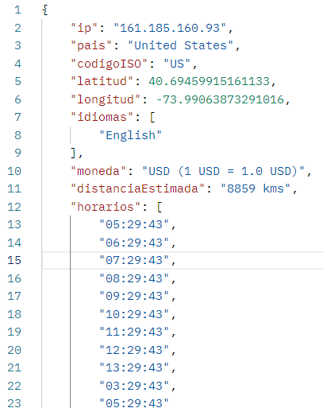
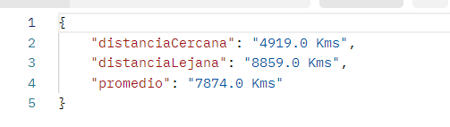

# Proyecto Geolocalización

En el proyecto implemente Clean Architecture, consumi APis públicas, implemente BD MySql y cola de mensajeria RabbitMQ. 

APIs públicas:

Geolocalización de IPs: https://ip2country.info/

Información de paises: https://restcountries.com/

Información sobre monedas: https://openexchangerates.org

Se creo un archivo dockerFile y docker-compose para ejecutar la aplicación en un contenedor Docker realizando los siguientes pasos:

1. Abrir una consola de comandos e ir a la ruta del proyecto.
2. Ejecutar el siguiente comando "docker build -t mi-aplicacion ." sin las comillas, este comando construye la imagen Docker.
3. Ejecutar el siguiente comando "docker-compose up --build" sin las comillas, este comando ejecuta multiples servicios basado en el archivo docker-compose.yml. Para este proyecto necesito tener aparte de la aplicacion una BD Mysql y RabbitMQ, lo cual estan definidos en el archivo compose.

Despues de ejecutar los comandos la aplicación ya quedara desplegada.

## Consumir servicios

Se crearon dos endPoints para cumplir con los requerimientos establecidos

1. Primer servicio es para obtener la información completa de una dirección ip.

Servicio GET

Copiar el curl para consumir el servicio: curl --location 'http://localhost:8080/api/v1/ubicacion/161.185.160.93'

Ejemplo de respuesta

2. Segundo servicio es para obtener distancía más cercana, distancía más lejana y promedio de todas las ejecuciones.

Servicio GET

Copiar el curl para consumir el servicio: curl --location 'http://localhost:8080/api/v1/reporte'

Ejemplo de respuesta

